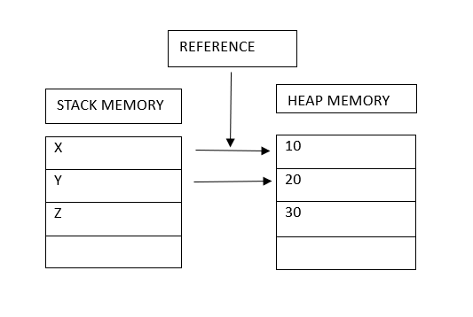
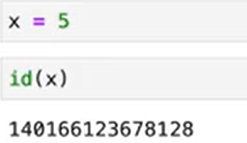

So here we gonna see about Variables,Data types,Comments,etc..

# What is Variable ?

Variable are the place holders for storing data.

>>X=5 # X is a variable here

There are some set of rules that should followed while declaring variable:

• A variable name must start with a letter or the underscore character
• A variable name cannot start with a number
• A variable name can only contain alpha-numeric characters and underscores (A-z, 0-9, and
_ )
• Variable names are case-sensitive (age, Age and AGE are three different variables)
• Inbuilt keywords should not be used as identifiers

# Stack & Heap Memory

Stack & Heap memory are the subset of whole memory 

# Id function

Id funtion give the memory address of the object where it is stored.

# Comments in python

Comments in Python are identified with a hash symbol, #, and extend to the end of the line. 

Comments can be a valuable tool for making your code more readable and maintainable.

#This is a single-line comment.

print("Hello, world!") 

"""
This is a multi-line comment.

It can span multiple lines.
"""

print("This is a line of code.")

# Data Types in python

# string

x = "Hello World"	 str

# integer

x = 20	 int	

# float

x = 20.5	float

#complex

x = 1j  complex	

#list

x = ["apple", "banana", "cherry"]  list	

#tuple

x = ("apple", "banana", "cherry")	 tuple

#range

x = range(6)	 range	

#dictionary

x = {"name" : "John", "age" : 36} 	dict

#set

x = {"apple", "banana", "cherry"} 	set	

#frozenset

x = frozenset({"apple", "banana", "cherry"})  frozenset

