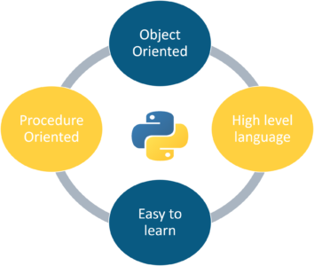

Hy Folks!
Lets learn python together.

# What is Python?

Python is a popular programming language. Python is an interpreted, object-oriented, high-level programming language with dynamic semantics. A Dutch programmer named Guido van Rossum created Python in the late 1980s.In December 1989, Guido began developing Python, and in February 1991, Python 0.9. 0, the first official version, was made available.

# What can Python do?

Python is a versatile programming language that can be used for many tasks, including:

AI & Machine Learning

Data science

Data analytics

Web development

Web scraping

Automation

# Why Python?

Easy to learn

simple syntax

Versatile

Powerful

Portable

Free and open source

This is all about python's intro stuff.
Lets start our python journy here tataa!
